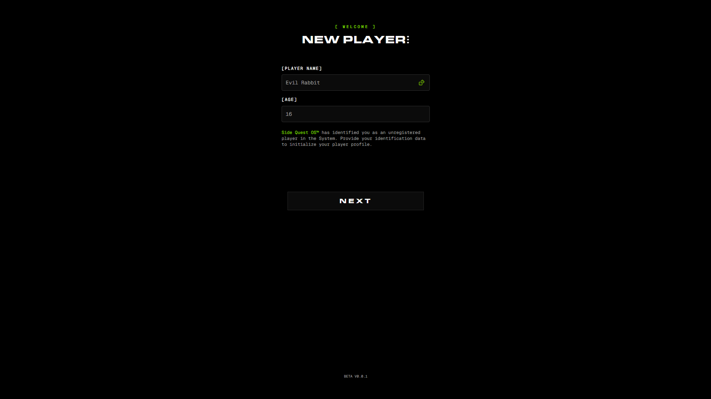
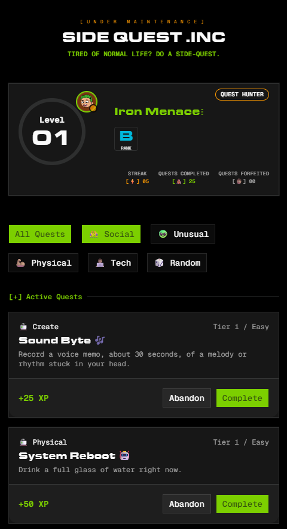

# Side Quest .Inc

> Tired of normal life? Do a Side-Quest — a gamified personal quest tracker that turns everyday tasks into XP.

[](https://nextjs.org)
[](https://react.dev)
[](https://www.typescriptlang.org)
[](https://tailwindcss.com)
[](https://zod.dev)

**🔗 Live site:** [sidequest-inc.vercel.app](https://sidequest-inc.vercel.app/initialize)



<!--  -->

---

## What is this?

Side Quest is a browser-based habit/quest tracker with a terminal-and-arcade aesthetic. Instead of a plain to-do list, you create a player profile and work through **quests** — small real-world prompts across categories like Social, Physical, Tech, and Unusual — to earn XP, level up, and build a streak.

- A **multi-step sign-up flow** that creates a player identity (name, age, avatar) via a typewriter-animated terminal header
- A **player profile card** showing level, rank, XP, and streak, with a typewriter-animated name reveal
- A **quest board** split into Active and New quests, filterable by category, with Initiate / Complete / Abandon actions
- A **quest log** of completed history, plus a "wipe all data" reset flow
- All progress is stored client-side in `localStorage` — no backend, no accounts

The whole thing leans into a retro terminal / DOS persona (`Side Quest .Inc`, `[SYSTEM STATUS]`, `beta v0.0.1`) rather than a conventional productivity-app UI.

## Highlights

- 🖥️ Typewriter-driven text reveals (site status header, player name) via a hand-rolled `use-typewriter` hook
- 🎮 Multi-step sign-up wizard built with `react-hook-form` + `zod`, with per-step field validation and a random player-name generator
- 🧩 Data-driven quest board — quest data and categories live in `lib/quests.ts` and are mapped into `Button`/`QuestCard` components rather than hardcoded JSX
- 🎨 shadcn/Radix UI primitives (Accordion, Dialog, Avatar, Progress, Badge) styled with Tailwind v4
- 💾 Local-first persistence — player and quest state read from / written to `localStorage`, no server required

---

## Project Structure

```
app/
├── layout.tsx                     # root layout: fonts, Header, Footer, Toaster
├── page.tsx                       # home: Summary, Quests, QuestLogs
├── loading.tsx
├── initialize/
│   └── page.tsx                   # entry point into the sign-up flow
├── pages/
│   └── sign-up-page.tsx
├── forms/sign-up/
│   ├── sign-up-form.tsx           # multi-step form state + player/quest initialization
│   └── steps/
│       ├── user-info-form.tsx     # name + age step
│       └── avatar-selection-form.tsx
├── sections/
│   ├── summary.tsx                # player profile card section
│   ├── quests.tsx                 # category filters + Active/New quest accordions
│   └── questLogs.tsx              # completed quest log + data-wipe dialog
└── hooks/
    ├── use-typewriter.tsx
    └── useRandomNameGenerator.ts

components/
├── cards/
│   ├── player-profile-card.tsx    # level, rank, XP, streak
│   └── quest-card.tsx             # title, category, XP, tier, status actions
├── items/
│   └── log-item.tsx
├── layout/
│   ├── header.tsx                 # animated site-status header
│   └── footer.tsx
└── ui/                            # shadcn/Radix primitives (button, card, accordion, dialog, ...)

lib/
├── quests.ts                      # QUEST_CATEGORIES, QUESTS, Quest/QuestStatus types
├── site-status.ts                 # SITE_STATUS single source of truth
└── utils.ts                       # cn() helper
```

## Tech Stack

| Layer              | Tools                                                      |
| ------------------ | ---------------------------------------------------------- |
| Framework          | Next.js 16 (App Router, Turbopack) · React 19 · TypeScript |
| Forms & Validation | React Hook Form · Zod                                      |
| Styling            | Tailwind CSS v4 · tailwind-merge · tw-animate-css          |
| UI Primitives      | Radix UI · shadcn · class-variance-authority               |
| Notifications      | Sonner (toasts)                                            |
| Theming            | next-themes                                                |
| Icons              | lucide-react                                               |

## Core Features

### Sign-Up Flow (`app/forms/sign-up/sign-up-form.tsx`)

A two-step form (`user-info-form.tsx` → `avatar-selection-form.tsx`) driven by a single `react-hook-form` instance and a shared Zod schema, validated per-step via `form.trigger()`. On submit, it seeds `localStorage` with a fresh `PLAYER` record and the default `QUESTS` list, then redirects home.

### Player Profile Card (`components/cards/player-profile-card.tsx`)

Reads the `PLAYER` record from `localStorage` and renders level, rank, avatar, and streak. Uses a lazy `useState` initializer guarded by `typeof window` so it doesn't crash during server rendering, and animates the player's name in with `use-typewriter`.

### Quest Board (`app/sections/quests.tsx`)

Category filter buttons and quest cards are both rendered by mapping over data in `lib/quests.ts` (`QUEST_CATEGORIES`, `QUESTS`) rather than being hand-written per item. Quests are grouped into collapsible "Active" / "New" accordions by `status`, and completing the initiate action updates that quest's status in state and persists it back to `localStorage`.

### Quest Log & Reset (`app/sections/questLogs.tsx`)

Lists completed quests and offers a destructive "wipe all data" dialog for resetting local progress — a reminder that everything in this app lives in the browser, not a database.

---

## Status

This app is a **work in progress** — some pieces (quest completion/abandon flows, quest logs data wiring) are stubbed or partially connected while the data model settles.

| Area                     | Description                                               | Status         |
| ------------------------ | --------------------------------------------------------- | -------------- |
| Sign-up flow             | Multi-step player creation                                | ✅             |
| Player profile card      | Level/rank/XP/streak display                              | ✅             |
| Quest board              | Category filters, Active/New quest lists, initiate action | ✅             |
| Quest complete / abandon | Status transitions beyond "Initiated"                     | 🚧 In progress |
| Quest logs               | Populate from real completed-quest history                | 🚧 In progress |

## Getting Started

First, run the development server:

```bash
npm run dev
# or
yarn dev
# or
pnpm dev
# or
bun dev
```

Open [http://localhost:3000](http://localhost:3000) with your browser to see the result.

```bash
npm run build   # production build
npm start       # serve production build
npm run lint    # lint
```

> **Note:** This project pins a pre-release Next.js version with breaking API changes from the current stable release. See `AGENTS.md` and `node_modules/next/dist/docs/` before making framework-level changes.
